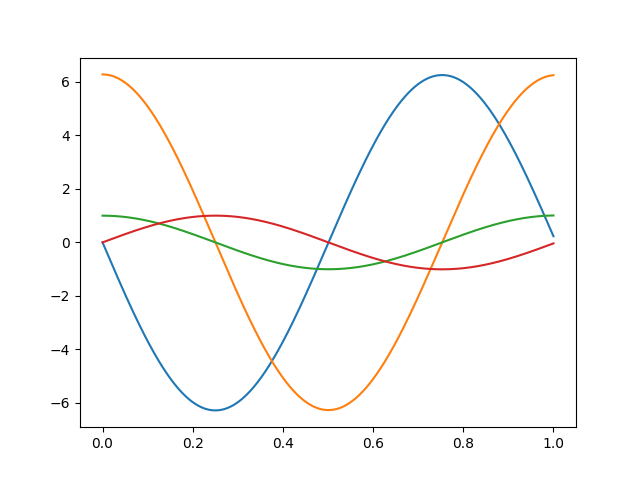
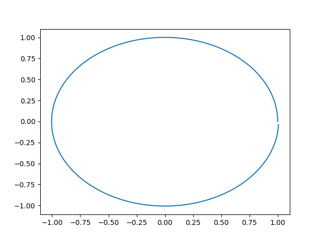
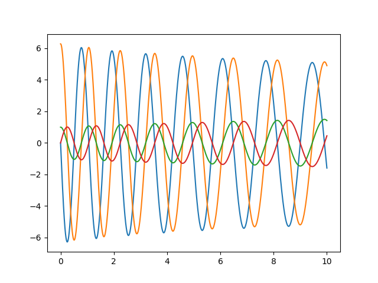
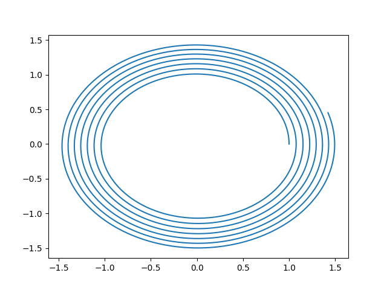

# Movimiento planetario.

Para este ejercicio tendremos en cuenta algunas ecuaciones diferenciales.
este será un problema de sistema de ecuaciones ordinales

(1) $\frac{dvx}{dt}=-\frac{\mu x}{(x^2+y^2)^{1.5}} $

(2) $\frac{dvy}{dt}=-\frac{\mu y}{(x^2+y^2)^{1.5}} $

(3) $\frac{dx}{dt}= Vx$

(4) $\frac{dy}{dt}= Vy$

este sera nuestro sistema de ecuaciones, el cual implementaremos con Euler.

* Recordemos que usaremos methodos numericos en el cual el lenguaje principal sera Python*

### Importemos librerias
   ```py
   import numpy as np 
   import math
   import matplotlib.pyplot as plt
   import pandas as pd
   import sympy as sp
   ```
 Para los valores debemos tener en cuenta que $\mu = 4\pi ^2 $ YA los demas valores serán arrojados por el codigo, además estamos hablando de  unidades astronomicas, tal que el año sera nuestro variable de tiempo, para los valores iniciales del sistema de ecuaciones tomaremos en cuenta lo visto en clase, y una distancia de 1 UA/Y.

 Tal que:

 $X_0= 1$, $y_0 =0$ , $V_0x=0$ y por ultimo $V_oy=2\pi$

### Codigo implementado.
```py
def f(t,u):
    k1=2;k2=1.5;k3=1

    y=np.zeros((len(u)))

    y[0]=-4*np.pi**2*u[2]/((u[2]**2+u[3]**2)**(3/2))  # implementacion del sistema de ecuaciones.
    y[1]=-4*np.pi**2*u[3]/((u[2]**2+u[3]**2)**(3/2))
    y[2]=u[0]
    y[3]=u[1]
    return y

def eu_vec(a,b,n,u):
    h=(b-a)/n
    t=np.arange(a,b+h,h)
    w=[]
    w.append(u)
    for i in range(1,n+1):
        w.append(w[i-1]+h*f(t[i-1],w[i-1]))
    df= pd.DataFrame((w))#,columns=["u3","u2","u1"])
    plt.plot(t,w)
    return df#df.tail()
u=np.array([0,2*np.pi,1,0])
```python

# Plots
## grafica del sistema en 1 año
```py
A=eu_vec(0,1,10000,u) # 0 años, hasta 1 año, 10000 iteraciones. grafica de todo el sistema con respecto al tiempo.
```


Esta claro que no se puede entender bien la imagen, pero en pocas palabras son los valores de la posición y de las derivadas..

## Posicion en 1 año
```py
plt.plot(A[2],A[3])
plt.savefig("Posicion en 1 año")
plt.show() #como vemos asemeja a un circulo.
```

Aqui podemos ver algo mas claro, luego de un año se cumple una elipse casi completa, como podemos ver no se pega exactamente, esto sucede realmente en la tierra
Como tal no hace una elipse perfecta, es ligeramente desfazada

## Luego de 10 años
```py
A=eu_vec(0,10,10000,u)
plt.savefig("Grafica de todo el sistema con respecto al tiempo de 0 a 10 años.")
```

Vemos algo repetitivo, siguiendo los mismos movimientos en el tiempo de la derivada y su posición.

## Posicion de 10 años
```py
plt.plot(A[2],A[3]) #una prueba de 10 años.
plt.savefig("posicion en 10 años")
plt.show() #como vemos asemeja a Muchos circulos
```


Las posiciones han sido bastante buenas y como vemos cada vez se hace "pequeño" pero nunca llega a completar el circulo, podriamos decir que la tierra se esta alejando en el eje (-x) si tomamos en cuenta unas coordenadas $r^3$

# Conclusion

- El método de Euler es una aproximación numérica de las soluciones a ecuaciones diferenciales. Esto significa que las trayectorias calculadas usando este método son aproximadas y pueden tener errores, especialmente cuando se utilizan intervalos de tiempo grandes
- Los planetas en nuestro sistema solar siguen órbitas elípticas alrededor del Sol, como lo describe la ley de gravitación universal de Newton. Estas órbitas elípticas son estables y están determinadas por la interacción gravitatoria entre el planeta y el Sol. Estas como podemos verlo en las imagenes no es una elipse perfecta, es muy circular para ser precisos , además de al irse moviendo la tierra vemos como nunca llega a concluir los puntos de partida iguales a los puntos finales anuales.
- A medida que un planeta orbita alrededor del Sol o mientras se tenga esta atraccion, su plano orbital también se mantiene en movimiento constante, Eso lo pudimos ver en las primeras graficas, siendo constantes en el paso del tiempo.
 
